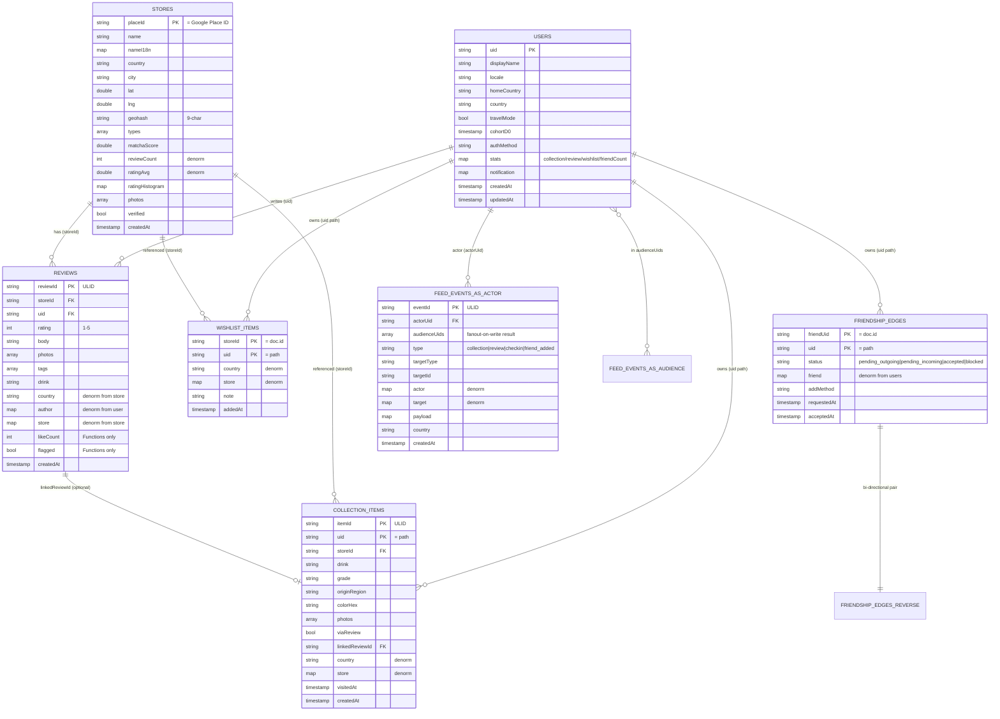

# ERD — MatchaMap Firestore 엔티티 관계도

- **작성**: `server-data` · 2026-05-04
- **상태**: Phase 2 산출물 (schema.md 동반)
- **문서 SSOT**: 본 ERD는 [schema.md](schema.md)의 시각화. 충돌 시 schema.md 우선.

---

## 1. 엔티티 다이어그램 (mermaid)



> mermaid가 깨진 환경에서는 § 2 ASCII 다이어그램을 참조.

---

## 2. ASCII 관계 다이어그램

```
                        ┌────────────────────────────────┐
                        │           users/{uid}          │
                        │  - displayName, photoURL       │
                        │  - homeCountry, country        │
                        │  - travelMode, cohortD0        │
                        │  - stats.{collection,review,   │
                        │       wishlist,friend}Count    │
                        │  - notification.fcmToken       │
                        └────┬────────┬────────┬─────────┘
                             │        │        │
        ┌────────────────────┼────────┼────────┼───────────────────┐
        │                    │        │        │                   │
        │                    │        │        │                   │
   subcoll                subcoll  subcoll  subcoll              top-level
        │                    │        │        │                   │
        ▼                    ▼        ▼        ▼                   ▼
┌────────────────┐  ┌──────────────┐ ┌──────────────┐ ┌──────────────────┐
│ wishlists/     │  │ collections/ │ │ friendships/ │ │   reviews/       │
│  {uid}/items/  │  │  {uid}/items/│ │  {uid}/edges/│ │   {reviewId}     │
│  {storeId}     │  │  {itemId}    │ │  {friendUid} │ │  - storeId       │
│ - storeId      │  │ - storeId    │ │ - friendUid  │ │  - uid           │
│ - country      │  │ - drink      │ │ - status     │ │  - rating, body  │
│ - store{denorm}│  │ - grade      │ │ - friend{de} │ │  - photos, tags  │
│ - note         │  │ - colorHex   │ │ - requestedAt│ │  - country       │
│ - addedAt      │  │ - country    │ │ - acceptedAt │ │  - author{denorm}│
└────────┬───────┘  │ - viaReview  │ │ - addMethod  │ │  - store{denorm} │
         │          │ - linkedRev  │ └──────┬───────┘ │  - likeCount(Fn) │
         │          │ - visitedAt  │        │         │  - flagged(Fn)   │
         │          │ - createdAt  │        │         │  - createdAt     │
         │          └──────┬───────┘        │         └────────┬─────────┘
         │                 │                │                  │
         │                 │                │                  │
         ▼                 ▼                │                  ▼
   reference          reference             │             reference
         │                 │                │                  │
         ├─────────────────┴────────────────┼──────────────────┤
         │                                  │                  │
         ▼                                  ▼                  ▼
                            ┌───────────────────────────────────────┐
                            │       stores/{placeId}                │
                            │  doc.id = Google Place ID             │
                            │  - name, nameI18n                     │
                            │  - country, city, address             │
                            │  - lat, lng, geohash(9)               │
                            │  - types, matchaScore, priceLevel     │
                            │  - photos, primaryPhoto, coverPhoto   │
                            │  - reviewCount, ratingAvg(Fn)         │
                            │  - ratingHistogram(Fn)                │
                            │  - verified(Fn)                       │
                            └───────────────────────────────────────┘


                          ┌────────────────────────────────────┐
                          │       feed_events/{eventId}        │
                          │  - actorUid                        │
                          │  - audienceUids[] (fanout-on-write)│
                          │  - type, targetType, targetId      │
                          │  - actor{denorm}, target{denorm}   │
                          │  - payload (type-specific)         │
                          │  - visibility (friends|public)     │
                          │  - createdAt                       │
                          └─────────────┬──────────────────────┘
                                        │
                            actor reference + audience array
                                        │
                                        ▼
                                  users/{uid}


                          ┌────────────────────────────────────┐
                          │  analytics/sessions/{sessionId}    │ (optional)
                          │  analytics/events/{eventId}        │ (30d retention)
                          │  → GA4 export = SSOT               │
                          └────────────────────────────────────┘

(Fn) = Functions Admin SDK only (클라 write 차단)
{denorm} = denormalized snapshot (write fanout으로 정합 유지)
```

---

## 3. 관계 카디널리티

| 관계 | 종류 | 비고 |
|---|---|---|
| users → reviews | 1 : N | 한 사용자가 N개 리뷰 작성. |
| users → wishlist items | 1 : N | 서브컬렉션. doc.id = storeId(중복 불가). |
| users → collection items | 1 : N | 서브컬렉션. 같은 매장의 다른 음료 = 별도 카드 → 1 : N (storeId 단위 N 가능). |
| users → fcmTokens | 1 : N | 서브컬렉션. 다중 디바이스 푸시 토큰 SSOT (server-auth ADR-303 P1.1 정합). doc.id = `identifierForVendor`. |
| users ↔ users (friendships) | M : N | 양방향 두 doc(`A→B`+`B→A`). status 머신. |
| users → feed_events (actor) | 1 : N | actorUid 인덱스. |
| users ↔ feed_events (audience) | M : N | audienceUids array-contains. |
| stores → reviews | 1 : N | storeId 인덱스. |
| stores ← wishlist/collection/feed | N : N (denorm) | store doc 변경 시 fanout 갱신 책임 = Functions. |
| reviews → collection items | 1 : 0..1 | viaReview=true 일 때 linkedReviewId. |

---

## 4. 디노멀 데이터 흐름

```
WRITE PATH (Functions가 fanout 책임)
─────────────────────────────────────

[users/{uid}.displayName 변경]
        │
        ▼ Functions onUpdate
   ┌────┴────────────────────────────────────────┐
   │ batched updates (≤500 docs/batch)          │
   ├─ reviews where uid==X → author.displayName │
   ├─ feed_events where actorUid==X → actor.displayName │
   ├─ friendships/*/edges/X → friend.displayName       │
   └─ (모든 audience friend 측 friendship)             │
                                                       │
   ※ 500+ doc 시 Cloud Tasks로 chunk 분산

[stores/{placeId}.name 또는 primaryPhoto 변경]
        │
        ▼ Functions onUpdate
   ┌────┴────────────────────────────────────┐
   ├─ reviews where storeId==X → store.{name,primaryPhoto}
   ├─ wishlists/*/items/X → store.{name,primaryPhoto}
   ├─ collections/*/items where storeId==X → store.{name,primaryPhoto}
   └─ feed_events where targetId==X (type∈{review,collection}) → target.{name,primaryPhoto}


READ PATH (Single doc, 추가 read 0)
────────────────────────────────────

[리뷰 카드 표시]
   reviews/{rid} read 1회 → author.displayName, store.name, store.primaryPhoto 모두 포함.
   (디노멀 없이는 1 review + 1 user + 1 store = 3 reads × N개 = 비용 폭증.)

[피드 화면]
   feed_events where audienceUids array-contains me + orderBy createdAt desc + limit 20
   → 단일 쿼리 1회로 20건 doc + 모든 actor/target 정보 포함 (추가 read 0).

[프로필 매장 그리드(도감)]
   collections/{me}/items + orderBy visitedAt desc + limit 20
   → 단일 쿼리. store 정보 디노멀로 추가 read 0.
```

---

## 5. 컬렉션 단위 디스크 모델 요약

```
firestore-root/
├── users/{uid}
│   └── fcmTokens/{tokenId}                 ← 서브컬렉션, FCM 토큰 SSOT (다중 디바이스)
├── wishlists/{uid}/items/{storeId}        ← 서브컬렉션
├── collections/{uid}/items/{itemId}       ← 서브컬렉션
├── friendships/{uid}/edges/{friendUid}    ← 서브컬렉션 + 양방향 fanout
├── stores/{placeId}                       ← 큐레이션 마스터, write Functions only
├── reviews/{reviewId}                     ← 최상위 (collection group 쿼리)
├── feed_events/{eventId}                  ← 최상위, audienceUids fanout
├── likes/{reviewId}/users/{uid}           ← (security-rules P6) 좋아요 분리 컬렉션
└── analytics/
    ├── sessions/{sessionId}               ← optional, 30d retention
    └── events/{eventId}                   ← optional, GA4 SSOT
```

---

## 6. Phase 별 도입 순서

| Phase | 도입 컬렉션 | 사유 |
|---|---|---|
| Phase 2 (현재) | `users`, `stores`, `reviews`, `wishlists`, `collections`, `friendships`, `feed_events` | MVP 핵심. |
| Phase 3 | `likes`, `analytics/sessions`, `analytics/events` (선택) | 좋아요 + 분석 미러. |
| v1.1.0 | `usernames/{handle}` (handle lookup), `stores` 사용자 등록(`mm_` prefix) | 친구 검색 + UGC 매장. |
| v1.2.0 | global mirror (US/EU read replica) | ADR-301 § Supabase 트리거 정합. |

---

## 7. Changelog

| 일자 | 변경 | 작성자 |
|---|---|---|
| 2026-05-04 | 초안 (mermaid + ASCII 동반) | server-data |
